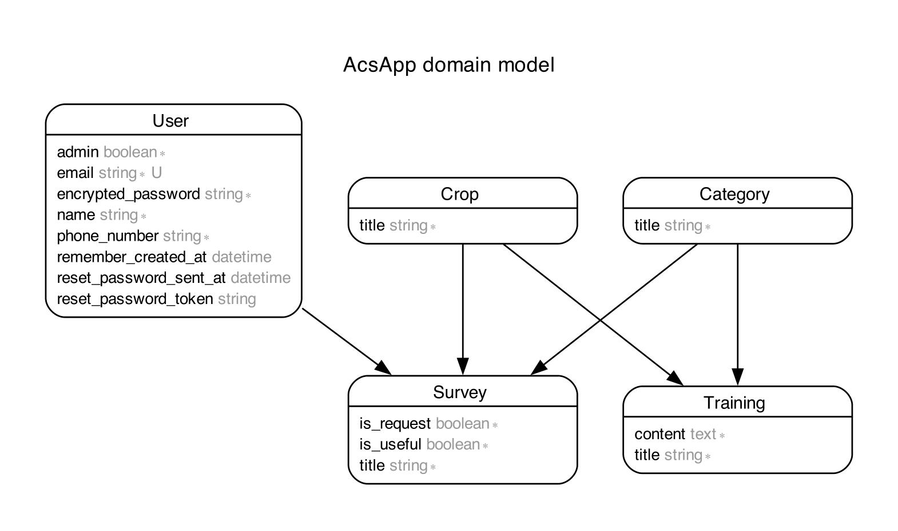

# README
## 開発言語
* ruby 3.0.1
* Rails 6.1.7.6
## 就職Termの技術
* gem devise
* AWS EC2
## カリキュラム外の技術
* gem ransack
## 実行手順
```
$ git clone git@github.com:dejima-yuya/doctor-agri.git
$ cd doctor-agri
$ bundle install
$ yarn install
$ rails db:create && rails db:migrate
$ rails db:seed
$ rails s
```
## カタログ設計
https://docs.google.com/spreadsheets/d/1XrdERofJuoJoBsJh4bcLvAwgvUTqyaFL-hiVeAlPQWk/edit#gid=1245264142
## テーブル定義書
https://docs.google.com/spreadsheets/d/1XrdERofJuoJoBsJh4bcLvAwgvUTqyaFL-hiVeAlPQWk/edit#gid=1707745237
## ワイヤーフレーム
https://docs.google.com/presentation/d/1yG9UPbMk0O3kFZC_L9NEeEvXAlcJC97JlmFDlE0453w/edit?usp=sharing
## ER図

